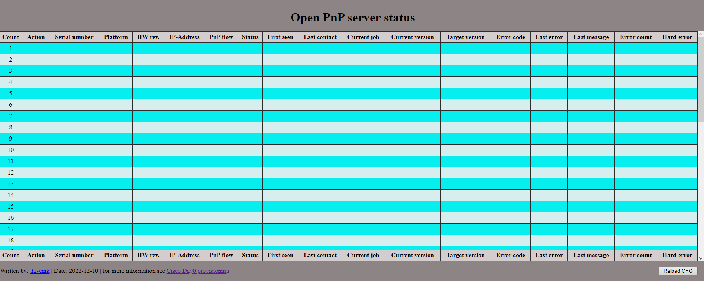
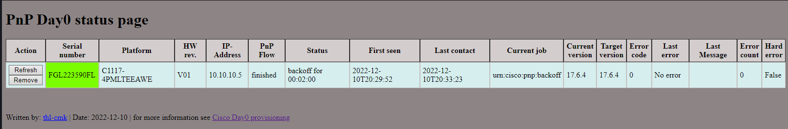

# Plug and Play (PnP) server for IOS/IOS-XE based devices 

# Introduction

This is a basic implementation of the Cisco Plug and Play protocol, to fully automate the day0 provisioning of Cisco IOS/IOS-XE devices.

### Acknowledgment 
This project is based on https://github.com/oliverl-21/Open-PnP-Server


## Prerequisites

- Your devices need to be PnP capable. This is true for most IOS/IOS-XE devices like ISR routers, Catalyst 9k Switches, ASR routers and so on.
- an HTTP server to store the images and config files
- a DHCP server to provide IP configuration and option 43 to the new devices (or DNS)
- a python 3.x environment to run this PnP server

## How to use

---
### IOS/IOS-XE Images
Place the IOS/IOS-XE images on an HTTP server where the new devices can download them. If you use this PnP server to 
provide the images place them in the `images` subdirectory. For the images I would recommend using a _real_ HTTP server.

---
### Configuration files
Create for each device a configuration file named SERIALNUMBER.cfg. i.e.: [`FCZ094210DS.cfg`](/pnp/configs/FGL223590FL.cfg). 
Place the configuration files also on your HTTP server, so the new devices can download them. In case the PnP server 
should deliver the configuration files, copy them in the `configs` subdirectory.

**Hint**: you can use different HTTP servers for the images and the configuration files

**Note**: the PnP server runs on HTTP. So there is no encryption for the configuration files as the are downloaded by the new devices.

---
### Install the PnP server:

on Linux
```
# clone the git repository
~/: git clone https://thl-cmk.hopto.org/gitlab/bits-and-bytes/cisco_day0_provision.git

# go to the pnp subproject
~/: cd cisco_day0_provision/pnp

# create a python virtual environment
~/cisco_day0_provision/pnp$ python3 -m venv .venv

# activate the environment
~/cisco_day0_provision/pnp$ source .venv/bin/activate

# update pip (optional)
(.venv) :~/cisco_day0_provision/pnp$ pip3 install -U pip

# install the required pyton packages
(.venv) :~/cisco_day0_provision/pnp$pip3 install flask xmltodict requests ifaddr tomli

# run the pnp server
(.venv) :~/cisco_day0_provision/pnp$ ./open-pnp.py --config_url  http://192.168.10.133:8080/configs --image_url http://192.168.10.133:8080/images

Running PnP server. Stop with ctrl+c
Bind to IP-address      : 0.0.0.0
Listen on port          : 8080
Image file(s) base URL  : http://192.168.10.133:8080/images
Config file(s) base URL : http://192.168.10.133:8080/configs

The PnP server is running on the following URL(s)
    http://192.168.10.133:8080

```

on Windows
```
c:\>git clone https://thl-cmk.hopto.org/gitlab/bits-and-bytes/cisco_day0_provision.git
c:\>cd cisco_day0_provision\pnp
c:\cisco_day0_provision\pnp>python -m venv .venv
c:\cisco_day0_provision\pnp>.venv\Scripts\activate.bat

(.venv)c:\cisco_day0_provision\pnp>pip install flask xmltodict requests ifaddr tomli

(.venv)c:\cisco_day0_provision\pnp>python open-pnp.py --config_url  http://192.168.10.133:8080/configs --image_url http://192.168.10.133:8080/images

Running PnP server. Stop with ctrl+c
Bind to IP-address      : ::
Listen on port          : 8080
Image file(s) base URL  : http://192.168.10.133:8080/images
Config file(s) base URL : http://192.168.10.133:8080/configs

The PnP server is running on the following URL(s)
    http://192.168.10.133:8080

```

You can check if the PnP server is running by opening a web browser and accessing the status page of the pnp server

`http://<your-ip>:8080/status`



---
### Configure the PnP server

to use the PnP server you need to configure the server by modifying the following files

- [**_open-pnp.toml_**](/pnp/open-pnp.toml)
- [**_images.toml_**](/pnp/images.toml)

**NOTE:** after changing the PnP server configuration you need to restart the PnP server.

**NOTE:** both files need to be in valid [TOML](https://toml.io/en/) format.

---
#### Global settings [**open-pnp.toml**](/pnp/open-pnp.toml)

```
# bind_pnp_server = "0.0.0.0"
# port = 8080
# time_format = "%Y-%m-%dT%H:%M:%S"
# status_refresh = 60
# debug = false
# log_to_console = false
# log_file = "log/pnp_debug.log"
# image_data = "images.toml"
# image_base_url = "http://192.168.10.133:8080/images"
# config_base_url = "http://192.168.10.133:8080/configs"
```

- **bind_pnp_server**: the IP-address of your open-pnp server box. (Use `"::"` for IPv6)
- **port**: the TCP port the server should listen on (remember for port 80 the server needs to run as root)
- **time_format**: the time format used in the status page
- **status_refresh**: the interval in seconds the status page will automatically reload
- **debug**: enable debug output with `debug = true`. Can be `true` or `false`.
- **log_file**: path/name of the log file
- **log_to_console**: send debug output to stdout. Can be `true` or `false`.
- **image_data**: the file containing the data of your IOS/IOS-XE images
- **image_base_url**: the base URL for your images 
- **config_base_url**: the base URL for your configuration files

**Note**: you need to uncomment (remove `# `) the lines if you change the values.

---
#### _IMAGES_ file [**_images.toml_**](/pnp/images.toml)

Each entry in the _IMAGES_ file contains
- the **name** of the image file as section title
- the IOS/IOS-XE **version** of the image
- the **md5** checksum of the image file
- the **size** of the image file in bytes
- a list of **models** where that image should be used

```
["c1000-universalk9-mz.152-7.E7.bin"]
version = "15.2(7)E7"
md5 = "1e6f508499c36434f7035b83a4018390"
size = 16499712
models = ["C1000-8T-2G-L", "C1000-24P-4G-L", "C1000-24T-4G-L", "C1000-24T-4X-L", "C1000-48P-4G-L", "C1000-48T-4X-L"]

```

**NOTE:** By default _open-pnp_ expects the image data in _images.toml_. You can change this with the key _image_data_ in _open-pnp.toml_.

---
### Command Line Options

With the Command Line Options you can override the default values, and the values from the _open-pnp.toml_ config file.
With the option --config_file CONFIG_FILE you can specify a costume config file to use instead of _open.pnp.toml_.   

```
$ ./open-pnp.py -h
usage: open-pnp.py [-h] [--bind_pnp_server BIND_PNP_SERVER] [--port PORT]
                   [--time_format TIME_FORMAT]
                   [--status_refresh STATUS_REFRESH] [--debug]
                   [--log_to_console] [--log_file LOG_FILE]
                   [--image_data IMAGE_DATA] [--image_url IMAGE_URL]
                   [--config_url CONFIG_URL] [--config_file CONFIG_FILE]

This is a basic implementation of the Cisco PnP protocol. It is intended to
roll out image updates and configurations for Cisco IOS/IOS-XE devices on
day0.

optional arguments:
  -h, --help            show this help message and exit
  --bind_pnp_server BIND_PNP_SERVER, -b BIND_PNP_SERVER
                        Bind PnP server to IP-address. (default: 0.0.0.0)
  --port PORT, -p PORT  TCP port to listen on. (default: 8080)
  --time_format TIME_FORMAT
                        Format string to render time. (default:
                        %Y-%m-%dT%H:%M:%S)
  --status_refresh STATUS_REFRESH, -r STATUS_REFRESH
                        Time in seconds to refresh PnP server status page.
                        (default: 60)
  --debug               Enable Debug output send to "log_file".
  --log_to_console      Enable debug output send to stdout (requires --debug).
  --log_file LOG_FILE   Path/name of the logfile. (default: log/pnp_debug.log,
                        requires --debug)
  --image_data IMAGE_DATA
                        File containing the image description. (default:
                        images.toml)
  --image_url IMAGE_URL
                        Download URL for image files. I.e.
                        http://192.168.10.133:8080/images
  --config_url CONFIG_URL
                        Download URL for config files. I.e.
                        http://192.168.10.133:8080/configs
  --config_file CONFIG_FILE
                        Path/name of open PnP server config file. (default:
                        open-pnp.toml)

Written by: thl-cmk, for more information see: https://thl-cmk.hopto.org

```

---
### PnP server discovery
The IOS-XE device can discover a PnP server via DHCP option 43 or using DNS lookup for the hostname _pnpserver.your.domain_. Replaced _your.domain_ by the DNS domain the device receives via DHCP. With DHCP, the DHCP server needs to send the vendor option 43.

Structure of DHCP option 43:

- 5: DHCP sub-option for PnP
- A: feature-code for Active
- 1: Version
- D: Debug On
- K: Defines the Transport Protocol as 4 = HTTP
- B: Defines the Server Address as 2 = IPv4
- I: is your Server IP
- J: is your Server Port

Here a sample how to do this on an IOS/IOS-XE switch.
```
ip dhcp pool autoinstall
 network 192.168.10.0 255.255.255.0
 default-router 192.168.10.1
 option 43 ascii 5A1D;K4;B2;I192.168.10.15;J8080
 lease 0 2
```
For more details on PnP server discovery options see [PnP server discovery](https://developer.cisco.com/site/open-plug-n-play/learn/learn-open-pnp-protocol/). There you will also find an overview how the PnP protocol works. 

---
### PnP Status page

You can monitor the PnP progress on the PnP server status page.



**Hint** you can change the status page output by modifying the [**_status.html_**](/pnp/templates/status.html) file in the templates' subdirectory.
